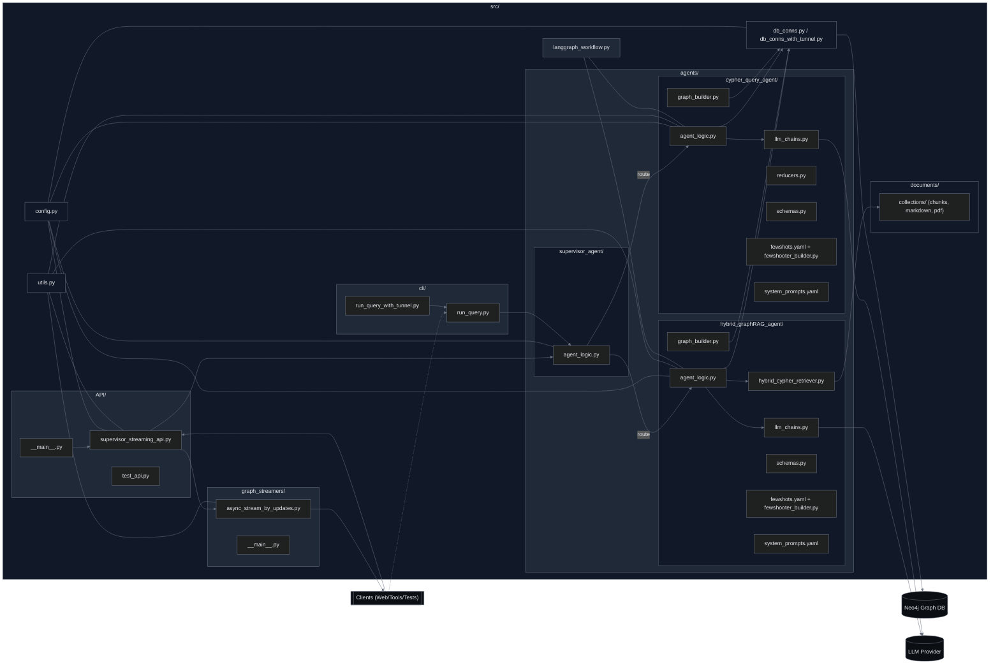

### Functional Architecture (focus on `src/`)

```mermaid
%%{init: {"theme": "dark", "themeVariables": {
  "background": "#0b0f14",
  "primaryColor": "#1f2937",
  "primaryTextColor": "#e5e7eb",
  "primaryBorderColor": "#4b5563",
  "lineColor": "#6b7280",
  "secondaryColor": "#111827",
  "tertiaryColor": "#374151",
  "clusterBkg": "#111827",
  "clusterBorder": "#4b5563",
  "defaultLinkColor": "#9ca3af",
  "titleColor": "#e5e7eb",
  "textColor": "#e5e7eb",
  "nodeBorder": "#6b7280",
  "fontFamily": "Inter, ui-sans-serif, system-ui, -apple-system, Segoe UI, Roboto, Helvetica, Arial"
}}}%%
flowchart LR
  %% Layout
  %% Focus on src/ components and how they interact

  subgraph SRC["src/"]
    direction LR

    subgraph API["API/"]
      direction TB
      API_main["__main__.py"]
      API_supervisor["supervisor_streaming_api.py"]
      API_test["test_api.py"]
    end

    subgraph AGENTS["agents/"]
      direction TB

      subgraph SUP["supervisor_agent/"]
        SUP_logic["agent_logic.py"]
      end

      subgraph CYPHER["cypher_query_agent/"]
        CQ_logic["agent_logic.py"]
        CQ_llm["llm_chains.py"]
        CQ_graph_builder["graph_builder.py"]
        CQ_reducers["reducers.py"]
        CQ_schemas["schemas.py"]
        CQ_fewshots["fewshots.yaml + fewshooter_builder.py"]
        CQ_system["system_prompts.yaml"]
      end

      subgraph HYBRID["hybrid_graphRAG_agent/"]
        HY_logic["agent_logic.py"]
        HY_llm["llm_chains.py"]
        HY_retriever["hybrid_cypher_retriever.py"]
        HY_graph_builder["graph_builder.py"]
        HY_schemas["schemas.py"]
        HY_fewshots["fewshots.yaml + fewshooter_builder.py"]
        HY_system["system_prompts.yaml"]
      end
    end

    subgraph STREAMERS["graph_streamers/"]
      direction TB
      STREAM_async["async_stream_by_updates.py"]
      STREAM_main["__main__.py"]
    end

    subgraph CLI["cli/"]
      CLI_run["run_query.py"]
      CLI_tunnel["run_query_with_tunnel.py"]
    end

    subgraph DOCS["documents/"]
      DOC_collections["collections/ (chunks, markdown, pdf)"]
    end

    CONFIG["config.py"]
    UTILS["utils.py"]
    DBCONNS["db_conns.py / db_conns_with_tunnel.py"]
    LANGWF["langgraph_workflow.py"]
  end

  %% External systems / actors
  CLIENTS[["Clients (Web/Tools/Tests)"]]
  NEO4J[("Neo4j Graph DB")]
  LLM[("LLM Provider")]

  %% Primary flows
  CLIENTS --> API_supervisor
  API_main --> API_supervisor
  API_supervisor --> SUP_logic
  API_supervisor --> STREAM_async
  STREAM_async --> CLIENTS

  %% Supervisor routes to specialized agents
  SUP_logic -->|"route"| HY_logic
  SUP_logic -->|"route"| CQ_logic

  %% Hybrid agent internals
  HY_logic --> HY_retriever
  HY_retriever --> DOC_collections
  HY_logic --> HY_llm
  HY_llm --> LLM

  %% Cypher agent internals
  CQ_logic --> CQ_llm
  CQ_llm --> LLM

  %% Database access
  HY_logic --> DBCONNS
  CQ_logic --> DBCONNS
  HY_graph_builder --> DBCONNS
  CQ_graph_builder --> DBCONNS
  DBCONNS --> NEO4J

  %% Shared utilities / config / workflow
  CONFIG --- API_supervisor
  CONFIG --- SUP_logic
  CONFIG --- HY_logic
  CONFIG --- CQ_logic
  CONFIG --- DBCONNS

  UTILS --- API_supervisor
  UTILS --- STREAM_async
  UTILS --- HY_logic
  UTILS --- CQ_logic

  LANGWF --- HY_logic
  LANGWF --- CQ_logic

  %% CLI entrypoints
  CLIENTS -.-> CLI_run
  CLI_tunnel --> CLI_run
  CLI_run --> SUP_logic

  %% Styling for readability
  style SRC fill:#111827,stroke:#4b5563,stroke-width:1px,color:#e5e7eb
  style API fill:#1f2937,stroke:#6b7280,color:#e5e7eb
  style AGENTS fill:#1f2937,stroke:#6b7280,color:#e5e7eb
  style STREAMERS fill:#1f2937,stroke:#6b7280,color:#e5e7eb
  style CLI fill:#1f2937,stroke:#6b7280,color:#e5e7eb
  style DOCS fill:#111827,stroke:#6b7280,color:#e5e7eb
  style CONFIG fill:#111827,stroke:#6b7280,color:#e5e7eb
  style UTILS fill:#111827,stroke:#6b7280,color:#e5e7eb
  style DBCONNS fill:#111827,stroke:#6b7280,color:#e5e7eb
  style LANGWF fill:#1f2937,stroke:#6b7280,color:#e5e7eb
  style NEO4J fill:#0b0f14,stroke:#6b7280,color:#e5e7eb
  style LLM fill:#0b0f14,stroke:#6b7280,color:#e5e7eb
  style CLIENTS fill:#0b0f14,stroke:#6b7280,color:#e5e7eb
```
