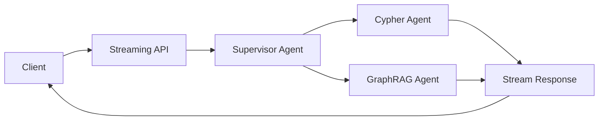

# Supervisor Agent Streaming API

A FastAPI-based streaming API for the supervisor agent that intelligently routes questions to specialized agents and streams responses in real-time.

## Overview

This API provides HTTP endpoints to interact with the supervisor agent, which analyzes questions and routes them to:
- **Cypher Query Agent**: For metadata queries (counts, locations, project names)
- **Hybrid GraphRAG Agent**: For content queries (species, environmental impacts, details)

## Features

- 🚀 **Real-time streaming** of agent responses
- 📊 **Multiple streaming formats**: JSON Lines, Server-Sent Events (SSE)
- 🎯 **Routing metadata**: Optional information about agent selection and reasoning
- 📚 **Interactive documentation**: Swagger UI and Scalar interfaces
- 🔄 **Non-streaming option**: Traditional JSON responses for compatibility
- ⚡ **Async processing**: High-performance concurrent request handling

## Installation

The API uses the main project dependencies. Ensure they are installed:

```bash
uv sync
```

Optional: Install Scalar for enhanced API documentation:

```bash
uv add scalar-fastapi
```

## Running the API

### Method 1: Run as module

```bash
uv run -m src.API
```

### Method 2: Run the file directly

```bash
uv run python src/API/supervisor_streaming_api.py
```

### Method 3: With custom settings

```bash
uvicorn src.API.supervisor_streaming_api:app --host 0.0.0.0 --port 8000 --reload
```

## API Endpoints

### Health Check

```bash
GET /health
```

Check if the service is running:

```bash
curl http://localhost:8000/health
```

### Streaming Endpoints

#### 1. Basic Streaming (`/ask`)

Stream the final answer from the supervisor:

```bash
curl -X POST http://localhost:8000/ask \
  -H "Content-Type: application/json" \
  -d '{
    "question": "¿Cuántos proyectos hay en total?"
  }'
```

Response format (JSON Lines):
```json
{"type": "answer", "content": "Hay un total de 82 proyectos."}
```

#### 2. Streaming with Metadata (`/ask-with-metadata`)

Get the answer plus routing information:

```bash
curl -X POST http://localhost:8000/ask-with-metadata \
  -H "Content-Type: application/json" \
  -d '{
    "question": "¿Qué especies de flora están en peligro?",
    "include_metadata": true
  }'
```

Response format (JSON Lines):
```json
{"type": "routing", "content": "Routing to graphrag_agent", "metadata": {"agent": "graphrag_agent", "reasoning": "..."}}
{"type": "answer", "content": "Las especies en peligro incluyen..."}
```

#### 3. Server-Sent Events (`/stream-sse`)

For browser EventSource compatibility:

```bash
curl -X POST http://localhost:8000/stream-sse \
  -H "Content-Type: application/json" \
  -d '{
    "question": "¿En qué regiones hay proyectos?"
  }'
```

Response format (SSE):
```
data: {"type": "answer", "content": "Los proyectos se encuentran en las siguientes regiones..."}

```

### Non-Streaming Endpoint

#### Complete JSON Response (`/ask-json`)

Wait for complete processing and return full JSON:

```bash
curl -X POST http://localhost:8000/ask-json \
  -H "Content-Type: application/json" \
  -d '{
    "question": "¿Cuántas comunas tienen proyectos?",
    "include_metadata": true
  }'
```

Response format:
```json
{
  "question": "¿Cuántas comunas tienen proyectos?",
  "answer": "60 comunas tienen proyectos.",
  "status": "success",
  "routing": {
    "agent": "cypher_agent",
    "reasoning": "The question asks about the number of communes..."
  }
}
```

## Request Parameters

All endpoints accept a `SupervisorRequest` body with these fields:

| Field | Type | Default | Description |
|-------|------|---------|-------------|
| `question` | string | Required | Natural language question in Spanish or English |
| `include_metadata` | boolean | false | Include routing decision and reasoning |
| `debug` | boolean | false | Enable debug output |
| `recursion_limit` | integer | 50 | Maximum graph recursion depth |

## JavaScript/Browser Example

### Using EventSource for real-time streaming:

```javascript
const eventSource = new EventSource('http://localhost:8000/stream-sse');

// Send question via POST
fetch('http://localhost:8000/stream-sse', {
  method: 'POST',
  headers: {'Content-Type': 'application/json'},
  body: JSON.stringify({
    question: '¿Cuántos proyectos hay?',
    include_metadata: false
  })
})
.then(response => {
  const reader = response.body.getReader();
  const decoder = new TextDecoder();

  function read() {
    reader.read().then(({done, value}) => {
      if (done) return;

      const chunk = decoder.decode(value);
      const lines = chunk.split('\n');

      lines.forEach(line => {
        if (line.startsWith('data: ')) {
          const data = JSON.parse(line.slice(6));
          console.log('Received:', data);
        }
      });

      read();
    });
  }

  read();
});
```

### Using fetch for JSON Lines:

```javascript
async function askSupervisor(question) {
  const response = await fetch('http://localhost:8000/ask', {
    method: 'POST',
    headers: {'Content-Type': 'application/json'},
    body: JSON.stringify({question})
  });

  const reader = response.body.getReader();
  const decoder = new TextDecoder();

  while (true) {
    const {done, value} = await reader.read();
    if (done) break;

    const lines = decoder.decode(value).trim().split('\n');
    for (const line of lines) {
      if (line) {
        const data = JSON.parse(line);
        console.log('Answer:', data.content);
      }
    }
  }
}
```

## Python Client Example

```python
import asyncio
import aiohttp
import json

async def stream_supervisor_response(question: str):
    """Stream responses from the supervisor API."""
    url = "http://localhost:8000/ask"

    async with aiohttp.ClientSession() as session:
        async with session.post(url, json={"question": question}) as response:
            async for line in response.content:
                if line:
                    data = json.loads(line)
                    print(f"Received: {data['content']}")

# Run the async client
asyncio.run(stream_supervisor_response("¿Cuántos proyectos hay?"))
```

## API Documentation

Once the server is running, access the interactive documentation:

- **Swagger UI**: http://localhost:8000/docs
- **ReDoc**: http://localhost:8000/redoc
- **Scalar** (if installed): http://localhost:8000/scalar

## Response Formats

### JSON Lines (application/x-ndjson)
Each line is a complete JSON object, suitable for streaming parsers:
```
{"type": "answer", "content": "..."}
{"type": "answer", "content": "..."}
```

### Server-Sent Events (text/event-stream)
W3C standard format for browser EventSource:
```
data: {"type": "answer", "content": "..."}

data: {"type": "answer", "content": "..."}

```

## Error Handling

The API returns appropriate HTTP status codes:

- `200`: Successful response (streaming or JSON)
- `400`: Bad request (empty question, invalid parameters)
- `500`: Internal server error (agent processing failed)

Error response format:
```json
{
  "detail": "Error message describing the issue"
}
```

## Performance Considerations

- **Streaming**: Responses are streamed as they're generated, reducing time to first byte
- **Async processing**: All operations are async for optimal concurrency
- **No buffering**: Headers disable proxy buffering for real-time streaming
- **Connection keep-alive**: SSE endpoint maintains persistent connections

## Architecture



## Development

### Running with auto-reload for development:

```bash
uv run -m src.API
```

### Testing endpoints:

```bash
# Test health check
curl http://localhost:8000/health

# Test basic streaming
curl -X POST http://localhost:8000/ask \
  -H "Content-Type: application/json" \
  -d '{"question": "¿Cuántos proyectos hay?"}'

# Test with metadata
curl -X POST http://localhost:8000/ask-with-metadata \
  -H "Content-Type: application/json" \
  -d '{"question": "¿Qué especies están en peligro?", "include_metadata": true}'

# Test SSE format
curl -X POST http://localhost:8000/stream-sse \
  -H "Content-Type: application/json" \
  -d '{"question": "¿En qué comunas hay proyectos?"}'

# Test non-streaming
curl -X POST http://localhost:8000/ask-json \
  -H "Content-Type: application/json" \
  -d '{"question": "¿Cuántas regiones tienen proyectos?", "include_metadata": true}'
```

## Deployment

For production deployment:

1. **Disable CORS wildcards**: Configure specific allowed origins
2. **Add authentication**: Implement API keys or OAuth
3. **Use HTTPS**: Deploy behind a reverse proxy with SSL
4. **Add rate limiting**: Prevent abuse with request limits
5. **Monitor performance**: Add logging and metrics
6. **Scale horizontally**: Deploy multiple instances with load balancing

Example production run:

```bash
uvicorn src.API.supervisor_streaming_api:app \
  --host 0.0.0.0 \
  --port 8000 \
  --workers 4 \
  --log-level warning \
  --access-log
```

## Troubleshooting

### Issue: No streaming output
- Check that client supports streaming (not all HTTP clients do)
- Verify `X-Accel-Buffering: no` header is present
- Ensure no proxy is buffering responses

### Issue: CORS errors in browser
- API allows all origins by default (`*`)
- For production, configure specific origins in CORS middleware

### Issue: Connection timeouts
- Streaming connections may be long-lived
- Configure timeouts appropriately in clients and proxies

## Related Components

- `src/graph_streamers/async_stream_by_updates.py`: Core streaming logic
- `src/agents/supervisor_agent/`: Supervisor agent implementation
- `KnowledgeGraphDB/Neo4j_KG_creation/API_for_graph.py`: Original API example

## License

Part of the CSW-NVIRO project.
