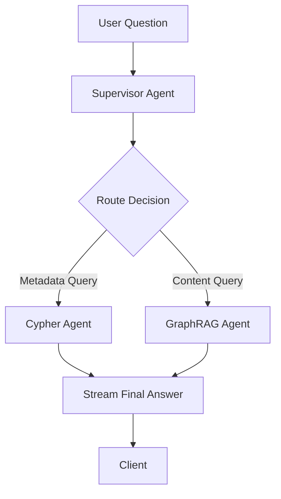

# Graph Streamers - Async Streaming for LangGraph Agents

This module provides async streaming capabilities for the supervisor agent, enabling real-time response streaming for web APIs and other asynchronous applications.

## Overview

The `async_stream_by_updates` module streams the final response from the supervisor agent, which intelligently routes questions to either:
- **Cypher Query Agent**: For metadata queries (counts, locations, project names)
- **Hybrid GraphRAG Agent**: For content queries (species, environmental impacts, detailed information)

## Features

- ✅ **Async streaming** of final responses only (no intermediate noise)
- ✅ **Metadata support** for routing decisions and reasoning
- ✅ **FastAPI compatible** for easy API integration
- ✅ **Error handling** with graceful fallbacks
- ✅ **Concurrent streaming** support for multiple queries

## Installation

The module is part of the main project. Ensure you have the project dependencies installed:

```bash
uv sync
```

## Basic Usage

### Simple Streaming

```python
import asyncio
from src.graph_streamers import stream_supervisor_updates

async def main():
    question = "¿Cuántos proyectos hay en total?"

    async for answer in stream_supervisor_updates(question):
        print(f"Answer: {answer}")

asyncio.run(main())
```

### Streaming with Metadata

```python
from src.graph_streamers import stream_supervisor_with_metadata

async def main():
    question = "¿Qué especies están en peligro?"

    async for update in stream_supervisor_with_metadata(question):
        if update["type"] == "routing":
            print(f"Routing to: {update['metadata']['agent']}")
            print(f"Reason: {update['metadata']['reasoning']}")
        elif update["type"] == "answer":
            print(f"Final answer: {update['content']}")

asyncio.run(main())
```

## API Integration

### FastAPI Example

```python
from fastapi import FastAPI
from fastapi.responses import StreamingResponse
from src.graph_streamers import stream_supervisor_updates

app = FastAPI()

@app.post("/ask")
async def ask_endpoint(question: str):
    return StreamingResponse(
        stream_supervisor_updates(question),
        media_type="text/event-stream"
    )
```

See `example_api_usage.py` for a complete FastAPI implementation with:
- Server-Sent Events (SSE) formatting
- Error handling
- CORS configuration
- Multiple endpoints (streaming and non-streaming)

## Testing

Run the test suite to verify functionality:

```bash
# Run tests with uv
uv run python src/graph_streamers/test_streamer.py

# Or run the example API
uv run python src/graph_streamers/example_api_usage.py
```

Then test the API with curl:

```bash
# Stream a response
curl -X POST "http://localhost:8000/ask" \
  -H "Content-Type: application/json" \
  -d '{"question": "¿Cuántos proyectos hay?"}'

# Get response with metadata
curl -X POST "http://localhost:8000/ask-with-metadata" \
  -H "Content-Type: application/json" \
  -d '{"question": "¿Qué especies están en peligro?", "include_metadata": true}'
```

## Architecture



## Stream Modes

The streamer uses `stream_mode="updates"` by default, which:
- Streams only state modifications after each graph step
- Filters out intermediate processing to provide clean output
- Buffers updates until the final answer is complete

## Parameters

### `stream_supervisor_updates`

| Parameter | Type | Default | Description |
|-----------|------|---------|-------------|
| `question` | str | Required | The natural language question to process |
| `stream_mode` | str | "updates" | LangGraph streaming mode |
| `subgraphs` | bool | True | Include subgraph updates |
| `debug` | bool | False | Enable debug output |
| `recursion_limit` | int | 50 | Max graph recursion depth |
| `**extra_state` | Any | {} | Additional state fields |

### `stream_supervisor_with_metadata`

Same parameters as above, plus:

| Parameter | Type | Default | Description |
|-----------|------|---------|-------------|
| `include_routing` | bool | True | Include routing decision details |

## Response Format

### Basic Streaming
Returns a string with the final answer.

### With Metadata
Returns dictionaries with structure:
```python
{
    "type": "routing" | "answer" | "error",
    "content": str,
    "metadata": {
        "agent": "cypher_agent" | "graphrag_agent",
        "reasoning": str
    }
}
```

## Error Handling

The streamer handles various error scenarios:
- Empty questions
- Graph execution errors
- Timeout issues
- Invalid state

Errors are gracefully returned as part of the stream or as error responses in the API.

## Performance Considerations

- **Async execution**: All operations are async for optimal performance
- **Single response**: Only the final answer is streamed, reducing bandwidth
- **Concurrent support**: Multiple questions can be processed simultaneously
- **Memory efficient**: Uses generators to avoid loading entire responses in memory

## Future Enhancements

Potential improvements for future versions:
- [ ] Partial response streaming (stream as tokens are generated)
- [ ] Response caching for common questions
- [ ] WebSocket support for bidirectional communication
- [ ] Rate limiting and authentication
- [ ] Prometheus metrics integration

## Related Files

- `src/agents/supervisor_agent/agent_logic.py`: The supervisor agent implementation
- `KnowledgeGraphDB/Neo4j_KG_creation/graph_streamer.py`: Original streamer example
- `src/agents/cypher_query_agent/`: Cypher agent for metadata queries
- `src/agents/hybrid_graphRAG_agent/`: GraphRAG agent for content queries

## Contributing

When adding new features to the streamer:
1. Maintain backward compatibility
2. Add tests in `test_streamer.py`
3. Update this documentation
4. Follow the existing async patterns

## License

Part of the CSW-NVIRO project.
